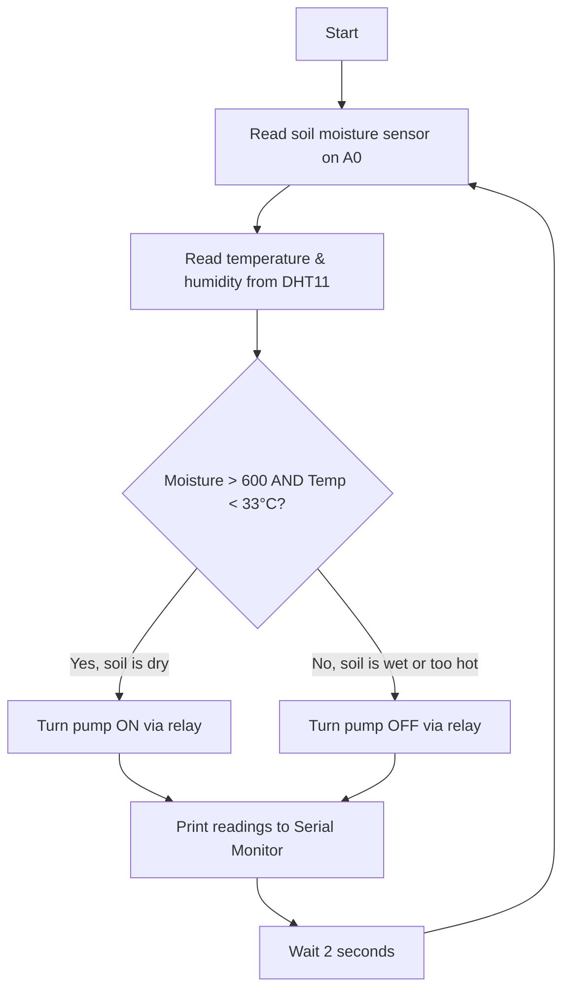

# 🌱 Smart Rooftop Gardening — Auto Gardening System

**Arduino-based automatic irrigation system that reads soil moisture and temperature, then switches a water pump on or off — no human intervention required.**


## Table of Contents
- [Overview](#overview)
- [Motivation](#motivation)
- [How It Works](#how-it-works)
- [Hardware Components](#hardware-components)
- [Firmware](#firmware)
- [Getting Started](#getting-started)
- [Advantages of Automatic Irrigation](#advantages-of-automatic-irrigation)
- [Future Work](#future-work)

## Overview

This project is an Arduino Uno-based auto gardening / irrigation controller built for a Microcontroller Lab course at Mymensingh Engineering College. A capacitive soil moisture sensor and a DHT11 temperature/humidity sensor continuously monitor a plant bed; a relay switches a 5V water pump on when the soil is dry and the temperature is below a set threshold, and off otherwise — automating watering without a human checking the soil by hand.

The system was built to address a practical problem in Bangladesh, where agriculture is heavily dependent on rainfall and irrigation scheduling is often manual. Automating that decision — water on when dry, water off when wet — removes the guesswork and the need to monitor it constantly.

## Motivation

Rising food demand and shrinking water availability make efficient irrigation increasingly important. Manually watering a garden or field means either overwatering (wasting water, compacting soil, washing out nutrients) or underwatering (stressed or dying plants) — especially when nobody's available to check the soil at the right time. An automatic system reacts to the actual condition of the soil rather than a fixed schedule.

| Circuit Setup | Serial Monitor Output |
|---|---|
|  |  |

## How It Works




## Hardware Components

| # | Component | Role |
|---|---|---|
| 1 | Arduino Uno (ATmega328P) | Main controller |
| 2 | DHT11 Temperature & Humidity Sensor | Reads air temperature and humidity |
| 3 | Capacitive Soil Moisture Sensor | Reads soil moisture level (analog) |
| 4 | 5V Water Pump | Delivers water to the plant bed |
| 5 | 5V Relay Module | Switches the pump on/off from a digital pin |
| 6 | Power Supply Cord (Arduino) | Powers the Arduino Uno |
| 7 | Female Headers | Sensor/board connections |
| 8 | Jumper Wires | General wiring |
| 9 | Breadboard | Prototyping platform |

**Arduino Uno key specs** used in this build: 14 digital I/O pins (6 PWM-capable), 6 analog inputs (10-bit resolution), 16 MHz clock, operates at 5V, max 40 mA per I/O pin.

**DHT11** reports both temperature and relative humidity as a calibrated digital signal, using a resistive humidity element and an NTC thermistor read by an onboard 8-bit controller.

**Relay module** pinout: Relay Trigger (digital input from Arduino), Ground, VCC, Normally Open, Common, Normally Closed. Rated up to 250VAC/30VDC at 10A on the switched side — enough headroom to safely switch a small water pump from a low-voltage Arduino signal.


## Firmware

Full sketch (Arduino IDE, `.ino`):

```cpp
// Libraries
#include <DHT.h>

// Constants
#define DHTPIN 5      // DHT11 signal pin
#define DHTTYPE DHT11 // DHT 11

DHT dht(DHTPIN, DHTTYPE); // Initialize DHT sensor for normal 16MHz Arduino

int h;    // Stores humidity value
int t;    // Stores temperature value
int msin; // Moisture sensor value

void setup() {
  Serial.begin(9600);
  dht.begin();
  pinMode(8, OUTPUT); // Relay signal pin
}

void loop() {
  // Reading temperature or humidity takes about 250 milliseconds!
  h = dht.readHumidity();
  t = dht.readTemperature();
  msin = analogRead(A0); // Capacitive soil moisture sensor

  Serial.print("Humidity: ");
  Serial.println(h);
  Serial.print("Temp: ");
  Serial.print(t);
  Serial.println(" ° Celsius");
  Serial.print("Moisture :");
  Serial.println(msin);

  if (msin > 600 && t < 33) {
    // Soil is dry and temperature is within range — turn pump on
    digitalWrite(8, HIGH);
    Serial.println("Pump is on now.");
  } else {
    // Soil is wet, or too hot — turn pump off
    digitalWrite(8, LOW);
    Serial.println("Pump is off now.");
  }

  delay(2000); // 2-second polling interval
}
```

**Logic summary:** the pump runs whenever the moisture reading is above 600 (dry soil) *and* temperature is below 33°C. Both conditions must hold — this prevents watering during unusually hot conditions where evaporation or heat stress might be a concern, though the exact reasoning behind the temperature cutoff isn't detailed in the report.

## Getting Started

### Hardware setup
1. Wire the DHT11 signal pin to Arduino digital pin 5, VCC to 5V, and GND to ground.
2. Wire the capacitive soil moisture sensor's analog output to A0, VCC to 5V, and GND to ground.
3. Wire the relay module's trigger pin to Arduino digital pin 8, VCC to 5V, and GND to ground.
4. Connect the water pump to the relay's switched output (Normally Open + Common), with the pump's own power supply run through the relay contacts.
5. Power the Arduino via USB or the DC jack (7–12V).

## Advantages of Automatic Irrigation

- **Prevents disease and weeds** — targeted watering at the root avoids wetting foliage (which encourages blight) and doesn't feed weed seeds the way broad sprinkling does.
- **Conserves water and time** — no manual hose duty at fixed times of day; the system only runs the pump when the soil is actually dry.
- **Preserves soil structure and nutrients** — smaller, controlled watering events reduce nutrient runoff and soil compaction compared to an open hose.
- **Gardening flexibility** — one section can be watered automatically while you work on another.

## Future Work

- **Mobile app control** — remote monitoring and manual override from a phone.
- **Wi-Fi connected monitoring** — real-time dashboards instead of only Serial Monitor output (e.g. via an ESP8266/ESP32 upgrade).
- **Extension beyond agriculture** — adapting the same sprinkler-based approach to residential gardens.
- **IoT integration** — combining sensor data logging with cloud services for historical trends and alerts.

